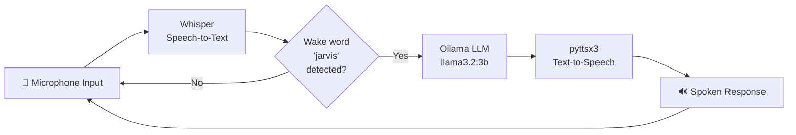

<div align="center">

# J.A.R.V.I.S.
### *Just A Rather Very Intelligent System*

A fully local, offline-first voice assistant — no cloud APIs, no data leaving your machine.

[](https://www.python.org/)
[](LICENSE)
[](https://ollama.com/)
[](https://github.com/openai/whisper)
[](#requirements)

</div>

---

## Overview

**Jarvis** is a self-hosted voice assistant inspired by the AI from *Iron Man* — built to run entirely on your own hardware, with no subscription, no API keys, and no internet dependency once set up.

It listens for a wake word, transcribes your voice locally with **Whisper**, reasons about it with a local **Ollama** LLM, and replies out loud with text-to-speech — all on a laptop with no GPU.

## Features

- 🎙️ **Local speech-to-text** via OpenAI Whisper — no audio ever leaves your device
- 🧠 **Local LLM reasoning** via Ollama (`llama3.2:3b`), fully offline
- 🔊 **Voice replies** via `pyttsx3` text-to-speech
- 🗣️ **Wake-word activation** — say "Jarvis" to trigger a response
- 🖥️ Runs on modest hardware — tested on a CPU-only laptop, no dedicated GPU required

## Architecture



## Project history

This repo tracks the evolution of the assistant from a basic text chatbot to a wake-word-driven voice assistant:

| Version | File | Description |
|---|---|---|
| v1 | `jarvis.py` | Text-only chat loop with Ollama + pyttsx3 TTS |
| v2 | `voice_jarvis.py` | Added voice input — press Enter, record 5s, transcribe with Whisper (`base`) |
| v3 | `jarvis_real.py` | Continuous listening loop with a "jarvis" wake word |
| **v4 (latest)** | `jarvis_final.py` | Whisper `small` model for better accuracy, 8s recording window, error handling, startup greeting |

## Requirements

- Python 3.10+
- [Ollama](https://ollama.com/) installed locally, with the model pulled:
  ```bash
  ollama pull llama3.2:3b
  ```
- A working microphone

## Installation

```bash
git clone https://github.com/YOUR_USERNAME/jarvis.git
cd jarvis
pip install -r requirements.txt
```

## Usage

Run the latest version:

```bash
python jarvis_final.py
```

Say **"Jarvis"** followed by your question or command. Say **"stop"**, **"exit"**, or **"shutdown"** to power down.

**Example:**
```
🎤 Listening...
You: jarvis what's the capital of France
Jarvis: The capital of France is Paris.
```

## Tested on

- Windows 11 / Linux
- CPU-only laptops (no dedicated GPU required)

## Roadmap

- [ ] Replace fixed-duration recording with voice-activity-detection (VAD) triggered recording
- [ ] Explore `faster-whisper` for lower CPU latency
- [ ] Reduce wake-word detection lag
- [ ] Add custom wake-word support (beyond "jarvis")
- [ ] Plug-in system for smart-home / system commands

## Contributing

Contributions are welcome — see [CONTRIBUTING.md](CONTRIBUTING.md) for setup instructions and guidelines.

## License

Released under the [MIT License](LICENSE).

---

<div align="center">
<sub>Built for the love of tinkering, not for Stark Industries. 🤖</sub>
</div>
